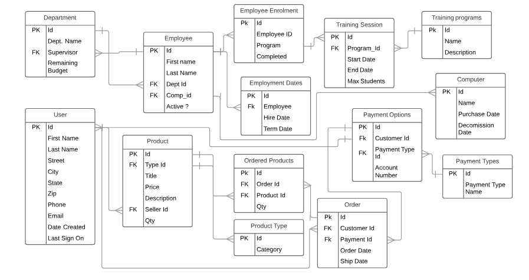

# Bangazon API


## To Run This App

1. Clone the repo.

**If you have not set up a virtual environment, do this stuff the first time you want to run this app:**

2. From the command line cd into the project directory
3. Run the following command: ```python -m venv bangazonvenv```
  * Note: the gitignore will automatically exclude any directory ending with "venv".
4. CD into the bangazonvenv directory
5. Run the following command: ```. Scripts/activate``` (might be different for Mac users)
  * You will know the virtual environment is running when the command prompt is preceded with ```(bangazonvenv)```
6. CD into the project root directory (should be a sibling of the bangazonvenv directory)
7. Run the following command: ```pip install django djangorestframework```
8. Run the following command: ```python manage.py runserver```
9. Open a web browser and navigate to [http://127.0.0.1:8000/](http://127.0.0.1:8000/)

**If you've already installed Django, etc. inside your virtual environment**

2. From the command line, cd into your bangazonvenv directory
3. Run the following command: ```. Scripts/activate``` (might be different for Mac users)
4. CD into the root directory (wherever the manage.py file is located).
5. Type ```python manage.py runserver``` into the command line.
6. Open a web browser and navigate to [http://127.0.0.1:8000/](http://127.0.0.1:8000/)

## To Reset the Database

(These instructions are unfinished right now)

1. Open the database in DB Browser.
2. Paste the "reset_database.sql" script into DB browser.
3. Run the code to delete existing tables and recreate them.

### ERD

ERD to define the properties of the following resources and the relationships between them.

#### Employees
* An employee can only be assigned to one department
* An employee can sign up for one, or more, training programs

#### Departments
* A department has a supervisor, a specific kind of Employee
* A department has an expense budget

#### Computers
* Track when a computer was purchased by the company
* Track when a computer was decommissioned by the company
* A computer can only be assigned to one employee at a time

#### Training Programs
* A training program must have a start date
* A training program must have an end date
* A training program must have maximum attendees specified

#### Product Types
* These are categories of Products

#### Products
* A product can only have one type
* A product has a price
* A product has a title
* A product has a description
* Products will be created by customers

#### Orders
* A customer can only have one active order at a time

#### Payment Types
* A customer can have multiple payment types (Visa, Amex, bank account, etc)
* A payment type must have an account number
* An order must be given a payment type before it is complete, but it not needed when order is created

#### Customers
* A customer's first and last name should be recorded separately
* The date that a customer created an account must be tracked
* If a customer does not interact with the system for over 240 days, they will be marked as inactive


