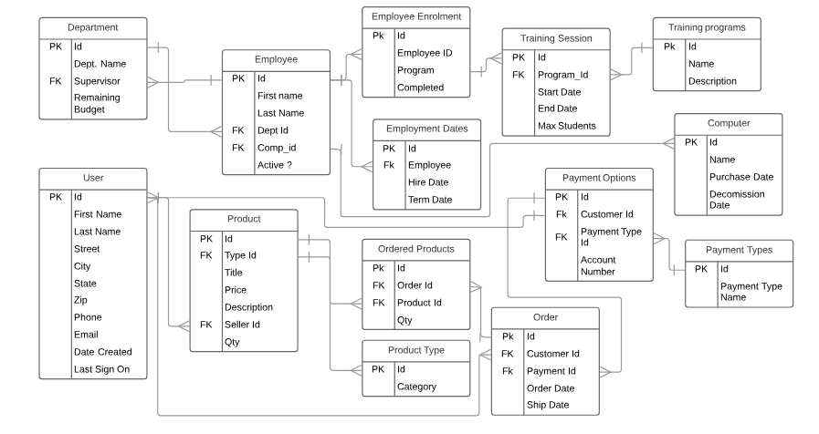

# Bangazon API


## To Run This App

1. Clone the repo.
1. Start your virtual machine (instructions below)
1. Delete all previous migrations
1. Re-migrate

```shell
python manage.py makemigrations bangazonapi
python manage.py migrate
```

## Setting up & Starting A Virtual Machine With Virtualenv (Mac):

```shell
virtualenv [filename]
source [filename]/bin/activate
```

## To Deactivate:

```deactivate```

## Virtual Machine With Pipenv (Mac):

Run environment in projects roots directory

```shell
pipenv shell
pipenv django
pipenv djangorestframework
pipenv django-seed
pipenv django-cors-headers
```

### To deactivate:

```shell
deactivate
exit
```


## Setting up Venv in Windows

**If you have not set up a virtual environment, do this stuff the first time you want to run this app:**

1. From the command line cd into the project directory
1. Run the following command: ```python -m venv bangazonvenv```
  * Note: the gitignore will automatically exclude any directory ending with "venv".
1. CD into the bangazonvenv directory
1. Run the following command: ```. Scripts/activate```
  * You will know the virtual environment is running when the command prompt is preceded with ```(bangazonvenv)```
1. CD into the project root directory (should be a sibling of the bangazonvenv directory)
1. Run the following command: ```pip install django djangorestframework django_seed django-cors-headers```
1. Run the following command: ```python manage.py runserver```
1. Open a web browser and navigate to [http://127.0.0.1:8000/](http://127.0.0.1:8000/)

**If you've already installed Django, etc. inside your virtual environment**

1. From the command line, cd into your bangazonvenv directory
1. Run the following command: ```. Scripts/activate```
1. CD into the root directory (wherever the manage.py file is located).
1. Type ```python manage.py runserver``` into the command line.
1. Open a web browser and navigate to [http://127.0.0.1:8000/](http://127.0.0.1:8000/)

## To Reset the Database

1. Find the ```django_data.sh``` file in the root directory of this project.
2. (Mac:) copy the file to ```usr/local/bin``` But please don't remove it from the project root because your Windows teammate needs it here.
> Mac: not entirely sure how to run the script. Check [Joe's tutorial](https://github.com/nashville-software-school/bangazon-llc/blob/master/DB_RESET_SEED_SYSTEM.md).
> Windows: cd to the project root and run the following command: ```./django_data.sh bangazonapi faker_factory```
**This will delete the entire database and reseed it with faked data. If you have an admin account you will need to recreate your superuser.**

(Optional)
When faker_factory is complete, copy and paste the SQL script in ```/bangazon_database/dataCheck.sql``` in DB Browser to verify that every table got data.

## To Migrate Models

In root directory:

```shell
python manage.py makemigrations bangazonapi
python manage.py migrate
```

## Admin Login

1. Head to http://127.0.0.1:8000/admin/
2. Login with:
Username: admin
password: password123
3. Able to create objects for tables

## Creating A User with REST Framework Interface

1. Head to [http://127.0.0.1:8000/bangazonapi/user/](http://127.0.0.1:8000/bangazonapi/user/)
1. Populate input fields with correlating data
1. POST to the API

## Database Requirements

### Employees

* An employee can only be assigned to one department
* An employee can sign up for one, or more, training programs

### Departments

* A department has a supervisor, a specific kind of Employee
* A department has an expense budget

### Computers

* Track when a computer was purchased by the company
* Track when a computer was decommissioned by the company
* A computer can only be assigned to one employee at a time

### Training Programs

* A training program must have a start date
* A training program must have an end date
* A training program must have maximum attendees specified

### Product Types

* These are categories of Products

### Products

* A product can only have one type
* A product has a price
* A product has a title
* A product has a description
* Products will be created by customers

### Orders

* A customer can only have one active order at a time

### Payment Types

* A customer can have multiple payment types (Visa, Amex, bank account, etc)
* A payment type must have an account number
* An order must be given a payment type before it is complete, but it not needed when order is created

### Customers

* A customer's first and last name should be recorded separately
* The date that a customer created an account must be tracked
* If a customer does not interact with the system for over 240 days, they will be marked as inactive

## ERD & Table Names



### Training_Program

* id
* Program_Name
* Program_Description

### Training_Program_Sessions

* id
* Program_ID (FK to Training_Program.Program_ID)
* Program_Start_Date
* Program_End_Date
* Max_Students

### User

* id
* First_Name
* Last_Name
* Street
* City
* State
* Zip
* Phone
* Email
* Date_Created
* Last_Signon

### Employee

* id
* First_Name
* Last_Name
* Dept_ID (FK to Department.Department_ID)
* Comp_ID (FK to Computer.Comp_ID)
* Is_Supervisor (bool; NOTE: right now with faker data, we may have situations where an a department may have multiple supervisors (or none). This will need to be fixed in a future iteration, probably by modifying the faker script.)

* Employee_Is_Active

### Employment_Dates

* id
* Employee_ID (FK to Employee.Employee_ID)
* Hire_Date (text in format MM/DD/YYYY)
* Term_Date (text in format MM/DD/YYYY)

### Department

* id
* Dept_Name
* Remaining_Budget (Integer. Need to place decimal before final two digits)

### Computer

* id
* Comp_Name
* Commission_Date (text in format MM/DD/YYYY)
* Decommission_Date (text in format MM/DD/YYYY)

### Employee_Training

* id
* Session_ID (FK to Training_Program.Session_ID)
* Employee_ID (FK to Employee.Employee_ID)
* Completed (integer 0 or 1)

### Product

* id
* Type_ID (FK to Product_Types.Type_ID)
* Seller_ID (FK to Users.User_ID)
* Title
* Price (Integer. Need to place decimal before final two digits)
* Description
* Quantity

### Product_Type

* id
* Product_Type_Name

### Cust_Order

* id
* Customer_ID (FK to User.User_ID)
* Payment_ID (FK to Payment_Options.Payment_ID)
* Order_Date (text in format MM/DD/YYYY)
* Ship_Date (text in format MM/DD/YYYY)

### Ordered_Products

* id
* Order_ID (FK to Cust_Order.Order_ID)Embedded order information
* Product_ID (FK to Product.Product_ID)Embedded product information
* Quantity

### Payment_Options

* id
* Customer_ID (FK to User.User_ID)
* Payment_Type_ID (FK to Payment_Type.Payment_Type_ID)
* Account_Num

### Payment_Type

* id
* Payment_Type_Name
